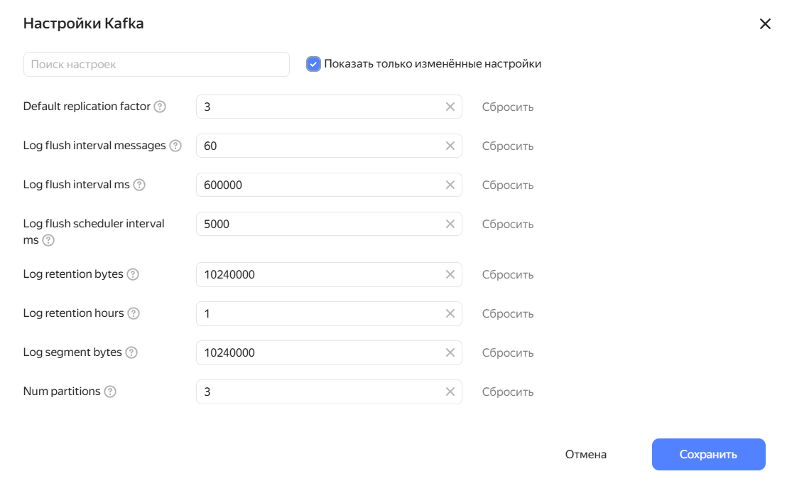
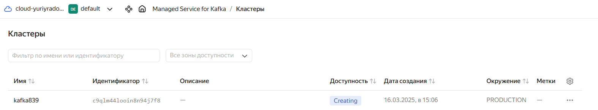
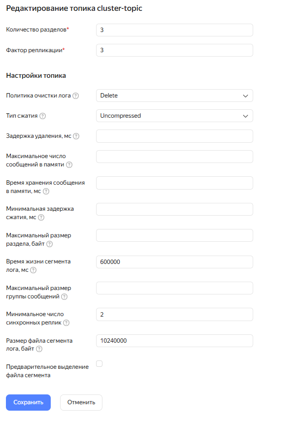
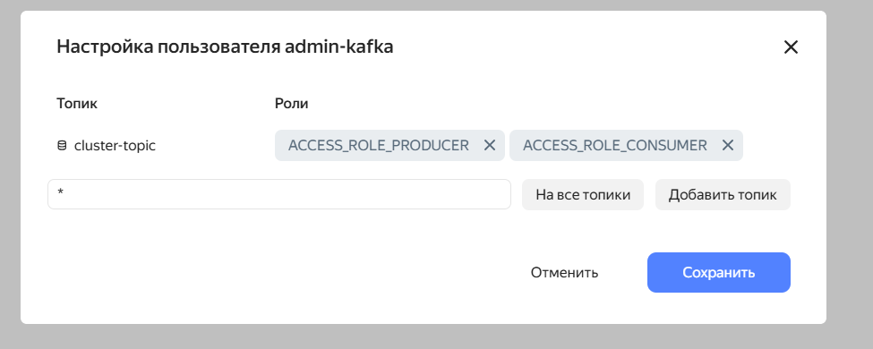
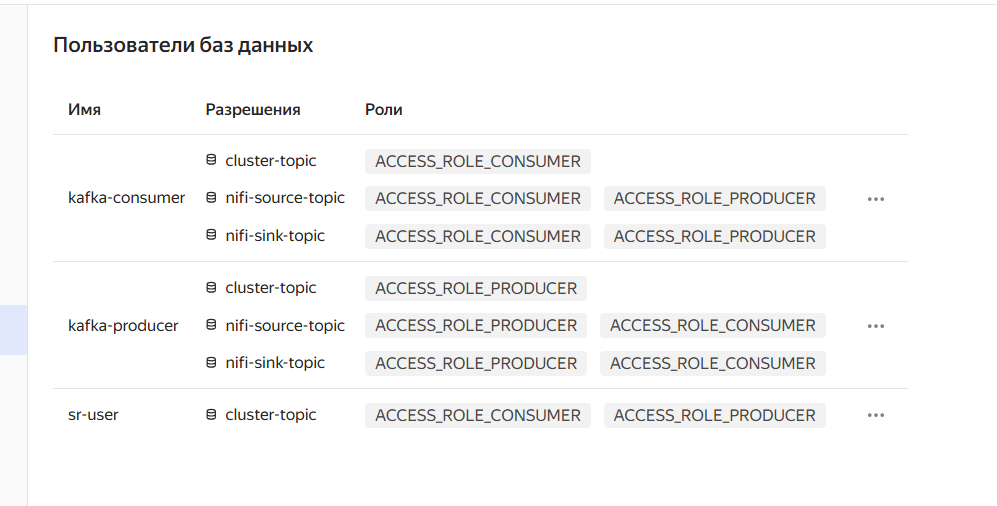
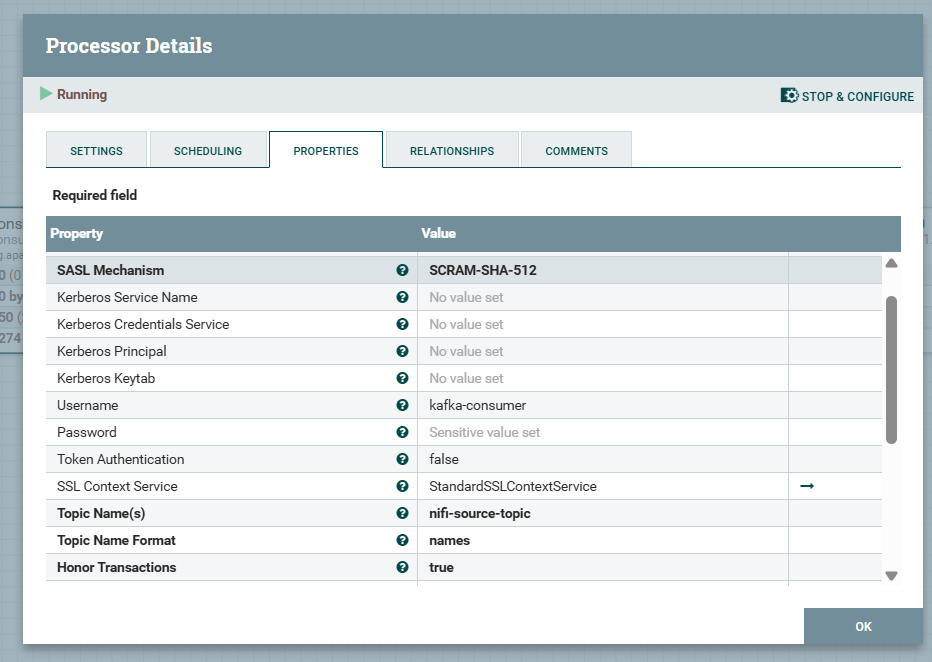
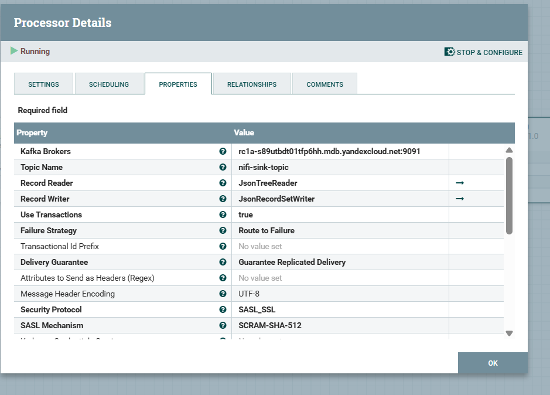
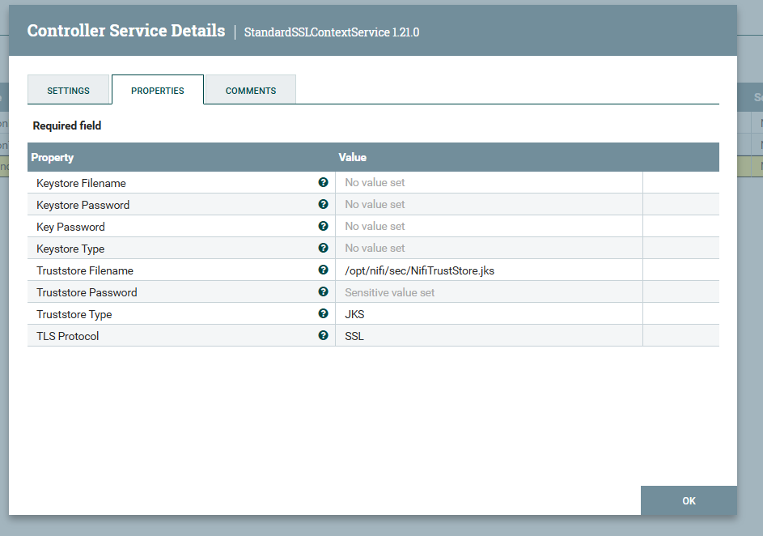
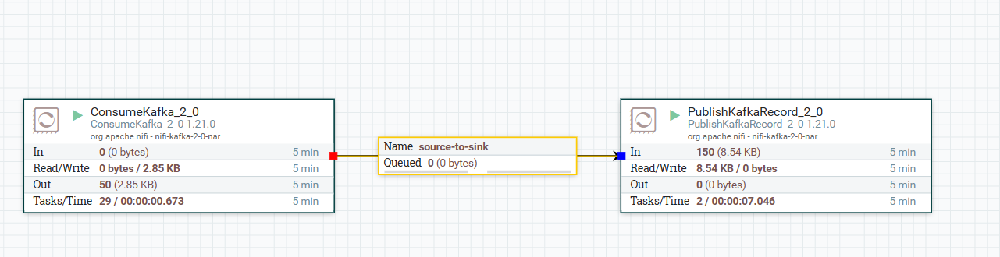

# TASK_1: Up cluster in cloud
### Kafka settings: default settings are used, only public host and schema registry toggles are set to true

### Creating cluster 

### Topic config

### Users


### Produce and consume messages
```
22:24:44.157 INFO  o.a.k.c.s.a.AbstractLogin - Successfully logged in.
22:24:44.182 INFO  o.a.kafka.common.utils.AppInfoParser - Kafka version: 3.5.0
22:24:44.182 INFO  o.a.kafka.common.utils.AppInfoParser - Kafka commitId: c97b88d5db4de28d
22:24:44.183 INFO  o.a.kafka.common.utils.AppInfoParser - Kafka startTimeMs: 1742318684182
22:24:44.183 INFO  p.k.sprint.six.components.Consumer - Starting consumer...
22:24:44.183 INFO  o.a.k.clients.consumer.KafkaConsumer - [Consumer clientId=consumer-consumer-1, groupId=consumer] Subscribed to topic(s): cluster-topic
22:24:44.183 INFO  p.k.sprint.six.components.Consumer - Polling ...
22:24:44.305 INFO  o.apache.kafka.clients.NetworkClient - [Producer clientId=producer-1] Disconnecting from node -1 due to socket connection setup timeout. The timeout value is 460 ms.
22:24:44.306 WARN  o.apache.kafka.clients.NetworkClient - [Producer clientId=producer-1] Bootstrap broker rc1a-s89utbdt01tfp6hh.mdb.yandexcloud.net:9091 (id: -1 rack: null) disconnected
22:24:44.692 INFO  org.apache.kafka.clients.Metadata - [Consumer clientId=consumer-consumer-1, groupId=consumer] Cluster ID: lbtZsGsrTtW-Ytde_DsG6g
22:24:44.693 INFO  o.a.k.c.c.i.ConsumerCoordinator - [Consumer clientId=consumer-consumer-1, groupId=consumer] Discovered group coordinator rc1b-n28esuhc7mcqonug.mdb.yandexcloud.net:9091 (id: 2147483645 rack: null)
22:24:44.695 INFO  o.a.k.c.c.i.ConsumerCoordinator - [Consumer clientId=consumer-consumer-1, groupId=consumer] (Re-)joining group
22:24:45.606 INFO  o.a.k.c.c.i.ConsumerCoordinator - [Consumer clientId=consumer-consumer-1, groupId=consumer] Request joining group due to: need to re-join with the given member-id: consumer-consumer-1-4cbf8c65-ebf3-4e15-bcb8-b5f20500d9c3
22:24:45.606 INFO  o.a.k.c.c.i.ConsumerCoordinator - [Consumer clientId=consumer-consumer-1, groupId=consumer] Request joining group due to: rebalance failed due to 'The group member needs to have a valid member id before actually entering a consumer group.' (MemberIdRequiredException)
22:24:45.606 INFO  o.a.k.c.c.i.ConsumerCoordinator - [Consumer clientId=consumer-consumer-1, groupId=consumer] (Re-)joining group
22:24:45.826 INFO  o.apache.kafka.clients.NetworkClient - [Producer clientId=producer-1] Disconnecting from node -1 due to socket connection setup timeout. The timeout value is 865 ms.
22:24:45.827 WARN  o.apache.kafka.clients.NetworkClient - [Producer clientId=producer-1] Bootstrap broker rc1a-s89utbdt01tfp6hh.mdb.yandexcloud.net:9091 (id: -1 rack: null) disconnected
22:24:46.675 INFO  o.a.k.c.c.i.ConsumerCoordinator - [Consumer clientId=consumer-consumer-1, groupId=consumer] Successfully joined group with generation Generation{generationId=1, memberId='consumer-consumer-1-4cbf8c65-ebf3-4e15-bcb8-b5f20500d9c3', protocol='range'}
22:24:46.681 INFO  o.a.k.c.c.i.ConsumerCoordinator - [Consumer clientId=consumer-consumer-1, groupId=consumer] Finished assignment for group at generation 1: {consumer-consumer-1-4cbf8c65-ebf3-4e15-bcb8-b5f20500d9c3=Assignment(partitions=[cluster-topic-0, cluster-topic-1, cluster-topic-2])}
22:24:46.987 INFO  o.a.k.c.c.i.ConsumerCoordinator - [Consumer clientId=consumer-consumer-1, groupId=consumer] Successfully synced group in generation Generation{generationId=1, memberId='consumer-consumer-1-4cbf8c65-ebf3-4e15-bcb8-b5f20500d9c3', protocol='range'}
22:24:46.987 INFO  o.a.k.c.c.i.ConsumerCoordinator - [Consumer clientId=consumer-consumer-1, groupId=consumer] Notifying assignor about the new Assignment(partitions=[cluster-topic-0, cluster-topic-1, cluster-topic-2])
22:24:46.999 INFO  o.a.k.c.c.i.ConsumerCoordinator - [Consumer clientId=consumer-consumer-1, groupId=consumer] Adding newly assigned partitions: cluster-topic-0, cluster-topic-1, cluster-topic-2
22:24:47.335 INFO  o.a.k.c.c.i.ConsumerCoordinator - [Consumer clientId=consumer-consumer-1, groupId=consumer] Found no committed offset for partition cluster-topic-2
22:24:47.335 INFO  o.a.k.c.c.i.ConsumerCoordinator - [Consumer clientId=consumer-consumer-1, groupId=consumer] Found no committed offset for partition cluster-topic-0
22:24:47.335 INFO  o.a.k.c.c.i.ConsumerCoordinator - [Consumer clientId=consumer-consumer-1, groupId=consumer] Found no committed offset for partition cluster-topic-1
22:24:47.831 INFO  o.a.k.c.c.i.SubscriptionState - [Consumer clientId=consumer-consumer-1, groupId=consumer] Resetting offset for partition cluster-topic-0 to position FetchPosition{offset=0, offsetEpoch=Optional.empty, currentLeader=LeaderAndEpoch{leader=Optional[rc1d-auqai0n0qi6o9aad.mdb.yandexcloud.net:9091 (id: 3 rack: ru-central1-d)], epoch=5}}.
22:24:47.854 INFO  o.a.k.c.c.i.SubscriptionState - [Consumer clientId=consumer-consumer-1, groupId=consumer] Resetting offset for partition cluster-topic-1 to position FetchPosition{offset=0, offsetEpoch=Optional.empty, currentLeader=LeaderAndEpoch{leader=Optional[rc1a-s89utbdt01tfp6hh.mdb.yandexcloud.net:9091 (id: 1 rack: ru-central1-a)], epoch=5}}.
22:24:47.861 INFO  o.a.k.c.c.i.SubscriptionState - [Consumer clientId=consumer-consumer-1, groupId=consumer] Resetting offset for partition cluster-topic-2 to position FetchPosition{offset=0, offsetEpoch=Optional.empty, currentLeader=LeaderAndEpoch{leader=Optional[rc1b-n28esuhc7mcqonug.mdb.yandexcloud.net:9091 (id: 2 rack: ru-central1-b)], epoch=4}}.
22:24:47.979 INFO  p.k.sprint.six.components.Consumer - Polled records: org.apache.kafka.clients.consumer.ConsumerRecords@79a7481d
**22:24:47.979 INFO  p.k.sprint.six.components.Consumer - Got 1 records for consumer, partitions: [cluster-topic-2]
22:24:47.980 INFO  p.k.s.six.components.MessageHandler - TOPIC: cluster-topic, USER: User[name=726, favoriteNumber=55, favoriteColor=RED]**
22:24:48.071 INFO  p.k.sprint.six.components.Consumer - Polling ...
22:24:48.142 INFO  org.apache.kafka.clients.Metadata - [Producer clientId=producer-1] Cluster ID: lbtZsGsrTtW-Ytde_DsG6g
22:24:48.224 INFO  o.a.k.c.p.i.TransactionManager - [Producer clientId=producer-1] ProducerId set to 1043 with epoch 0
22:24:48.802 INFO  p.k.sprint.six.components.Consumer - Polled records: org.apache.kafka.clients.consumer.ConsumerRecords@6642a319
22:24:48.802 INFO  p.k.sprint.six.components.Consumer - Got 1 records for consumer, partitions: [cluster-topic-2]
22:24:48.802 INFO  p.k.s.six.components.MessageHandler - TOPIC: cluster-topic, USER: User[name=333, favoriteNumber=759, favoriteColor=CYAN]
**22:24:48.808 INFO  p.k.s.six.components.UserProducer - Sent to topic: cluster-topic, partition: 2, offset; 1**
22:24:48.876 INFO  p.k.sprint.six.components.Consumer - Polling ...
22:24:52.891 INFO  p.k.sprint.six.components.Consumer - Polled records: org.apache.kafka.clients.consumer.ConsumerRecords@1cceeec1
22:24:52.891 INFO  p.k.sprint.six.components.Consumer - Polling ...
```

# TASK 2: Apache Nifi and Kafka

I can provide only screenshots and logs of result. 
It's impossible to run tasks on other machine without exposing certs and private rsa key.

### Create nifi network
```bash
docker network create nifi_net
```

### Up nifi
```bash
docker compose -p nifi -f ./infra/docker-compose-task-2.yaml up -d
```

### Adjusted cluster users


### Consumer processor properties


### Producer processor properties


### Common SSL-context service


### Examples: consumer processor read from nifi-source-topic, producer processor sends to nifi-sink-topic


### Fake load producer sends to nifi-source-topic
```
22:45:06.137 INFO  o.apache.kafka.clients.NetworkClient - [Producer clientId=producer-1] Disconnecting from node 1 due to socket connection setup timeout. The timeout value is 911 ms.
22:45:06.197 INFO  o.apache.kafka.clients.NetworkClient - [Producer clientId=producer-1] Disconnecting from node 2 due to socket connection setup timeout. The timeout value is 906 ms.
22:45:06.310 INFO  o.apache.kafka.clients.NetworkClient - [Producer clientId=producer-1] Disconnecting from node 3 due to socket connection setup timeout. The timeout value is 1058 ms.
22:45:06.331 INFO  p.k.s.six.components.UserProducer - Sending message: User[name=289, favoriteNumber=638, favoriteColor=PINK]
22:45:06.511 INFO  p.k.sprint.six.components.Consumer - Polled records: org.apache.kafka.clients.consumer.ConsumerRecords@5f5fdd4f
22:45:06.511 INFO  p.k.sprint.six.components.Consumer - Polling ...
22:45:07.028 INFO  p.k.s.six.components.UserProducer - Sending message: User[name=594, favoriteNumber=560, favoriteColor=CYAN]
22:45:07.377 INFO  p.k.s.six.components.UserProducer - Sent to topic: nifi-source-topic, partition: 1, offset; 37
22:45:07.377 INFO  p.k.s.six.components.UserProducer - Sent to topic: nifi-source-topic, partition: 1, offset; 39
22:45:07.377 INFO  p.k.s.six.components.UserProducer - Sent to topic: nifi-source-topic, partition: 1, offset; 38
22:45:07.377 INFO  p.k.s.six.components.UserProducer - Sent to topic: nifi-source-topic, partition: 1, offset; 36
22:45:07.377 INFO  p.k.s.six.components.UserProducer - Sent to topic: nifi-source-topic, partition: 1, offset; 40
22:45:07.410 INFO  p.k.s.six.components.UserProducer - Sent to topic: nifi-source-topic, partition: 2, offset; 36
22:45:07.410 INFO  p.k.s.six.components.UserProducer - Sent to topic: nifi-source-topic, partition: 2, offset; 37
22:45:07.421 INFO  p.k.s.six.components.UserProducer - Sent to topic: nifi-source-topic, partition: 0, offset; 48
22:45:07.421 INFO  p.k.s.six.components.UserProducer - Sent to topic: nifi-source-topic, partition: 0, offset; 49
22:45:07.421 INFO  p.k.s.six.components.UserProducer - Sent to topic: nifi-source-topic, partition: 0, offset; 50
22:45:07.421 INFO  p.k.s.six.components.UserProducer - Sent to topic: nifi-source-topic, partition: 0, offset; 51
22:45:07.899 INFO  p.k.s.six.components.UserProducer - Sending message: User[name=118, favoriteNumber=951, favoriteColor=ORANGE]
22:45:08.086 INFO  p.k.s.six.components.UserProducer - Sent to topic: nifi-source-topic, partition: 2, offset; 38
22:45:08.754 INFO  p.k.s.six.components.UserProducer - Sending message: User[name=454, favoriteNumber=756, favoriteColor=BLUE]
22:45:08.968 INFO  p.k.s.six.components.UserProducer - Sent to topic: nifi-source-topic, partition: 0, offset; 52
```

### Fake load consumer reads from nifi-sink-topic
``` 
22:45:18.067 INFO  p.k.s.six.components.UserProducer - Sent to topic: nifi-source-topic, partition: 2, offset; 43
22:45:18.516 INFO  p.k.sprint.six.components.Consumer - Polled records: org.apache.kafka.clients.consumer.ConsumerRecords@5f5fdd4f
22:45:18.516 INFO  p.k.sprint.six.components.Consumer - Polling ...
22:45:18.912 INFO  p.k.s.six.components.UserProducer - Sending message: User[name=260, favoriteNumber=882, favoriteColor=BLUE]
22:45:19.002 INFO  p.k.s.six.components.UserProducer - Sent to topic: nifi-source-topic, partition: 1, offset; 47
22:45:19.474 INFO  p.k.sprint.six.components.Consumer - Polled records: org.apache.kafka.clients.consumer.ConsumerRecords@7b7d6d77
22:45:19.474 INFO  p.k.sprint.six.components.Consumer - Got 33 records for consumer, partitions: [nifi-sink-topic-1]
22:45:19.474 INFO  p.k.s.six.components.MessageHandler - TOPIC: nifi-sink-topic, USER: User[name=689, favoriteNumber=284, favoriteColor=YELLOW]
22:45:19.474 INFO  p.k.s.six.components.MessageHandler - TOPIC: nifi-sink-topic, USER: User[name=888, favoriteNumber=840, favoriteColor=ORANGE]
22:45:19.474 INFO  p.k.s.six.components.MessageHandler - TOPIC: nifi-sink-topic, USER: User[name=194, favoriteNumber=263, favoriteColor=BLUE]
22:45:19.474 INFO  p.k.s.six.components.MessageHandler - TOPIC: nifi-sink-topic, USER: User[name=812, favoriteNumber=175, favoriteColor=PINK]
22:45:19.474 INFO  p.k.s.six.components.MessageHandler - TOPIC: nifi-sink-topic, USER: User[name=960, favoriteNumber=588, favoriteColor=GREEN]
22:45:19.474 INFO  p.k.s.six.components.MessageHandler - TOPIC: nifi-sink-topic, USER: User[name=682, favoriteNumber=875, favoriteColor=PINK]
22:45:19.474 INFO  p.k.s.six.components.MessageHandler - TOPIC: nifi-sink-topic, USER: User[name=669, favoriteNumber=521, favoriteColor=CYAN]
22:45:19.475 INFO  p.k.s.six.components.MessageHandler - TOPIC: nifi-sink-topic, USER: User[name=307, favoriteNumber=271, favoriteColor=BLUE]
22:45:19.475 INFO  p.k.s.six.components.MessageHandler - TOPIC: nifi-sink-topic, USER: User[name=335, favoriteNumber=318, favoriteColor=CYAN]
22:45:19.475 INFO  p.k.s.six.components.MessageHandler - TOPIC: nifi-sink-topic, USER: User[name=502, favoriteNumber=858, favoriteColor=ORANGE]
22:45:19.475 INFO  p.k.s.six.components.MessageHandler - TOPIC: nifi-sink-topic, USER: User[name=40, favoriteNumber=889, favoriteColor=YELLOW]
22:45:19.475 INFO  p.k.s.six.components.MessageHandler - TOPIC: nifi-sink-topic, USER: User[name=477, favoriteNumber=280, favoriteColor=GREEN]
22:45:19.475 INFO  p.k.s.six.components.MessageHandler - TOPIC: nifi-sink-topic, USER: User[name=208, favoriteNumber=136, favoriteColor=ORANGE]
22:45:19.475 INFO  p.k.s.six.components.MessageHandler - TOPIC: nifi-sink-topic, USER: User[name=370, favoriteNumber=817, favoriteColor=CYAN]
22:45:19.475 INFO  p.k.s.six.components.MessageHandler - TOPIC: nifi-sink-topic, USER: User[name=660, favoriteNumber=555, favoriteColor=CYAN]
22:45:19.475 INFO  p.k.s.six.components.MessageHandler - TOPIC: nifi-sink-topic, USER: User[name=796, favoriteNumber=365, favoriteColor=PINK]
22:45:19.475 INFO  p.k.s.six.components.MessageHandler - TOPIC: nifi-sink-topic, USER: User[name=807, favoriteNumber=890, favoriteColor=RED]
22:45:19.475 INFO  p.k.s.six.components.MessageHandler - TOPIC: nifi-sink-topic, USER: User[name=103, favoriteNumber=550, favoriteColor=BLUE]
22:45:19.475 INFO  p.k.s.six.components.MessageHandler - TOPIC: nifi-sink-topic, USER: User[name=127, favoriteNumber=739, favoriteColor=YELLOW]
22:45:19.475 INFO  p.k.s.six.components.MessageHandler - TOPIC: nifi-sink-topic, USER: User[name=205, favoriteNumber=329, favoriteColor=YELLOW]
22:45:19.475 INFO  p.k.s.six.components.MessageHandler - TOPIC: nifi-sink-topic, USER: User[name=281, favoriteNumber=988, favoriteColor=YELLOW]
22:45:19.475 INFO  p.k.s.six.components.MessageHandler - TOPIC: nifi-sink-topic, USER: User[name=579, favoriteNumber=324, favoriteColor=RED]
22:45:19.475 INFO  p.k.s.six.components.MessageHandler - TOPIC: nifi-sink-topic, USER: User[name=481, favoriteNumber=338, favoriteColor=PINK]
22:45:19.475 INFO  p.k.s.six.components.MessageHandler - TOPIC: nifi-sink-topic, USER: User[name=215, favoriteNumber=274, favoriteColor=PINK]
22:45:19.475 INFO  p.k.s.six.components.MessageHandler - TOPIC: nifi-sink-topic, USER: User[name=232, favoriteNumber=200, favoriteColor=PINK]
22:45:19.475 INFO  p.k.s.six.components.MessageHandler - TOPIC: nifi-sink-topic, USER: User[name=978, favoriteNumber=843, favoriteColor=ORANGE]
22:45:19.475 INFO  p.k.s.six.components.MessageHandler - TOPIC: nifi-sink-topic, USER: User[name=136, favoriteNumber=370, favoriteColor=ORANGE]
22:45:19.475 INFO  p.k.s.six.components.MessageHandler - TOPIC: nifi-sink-topic, USER: User[name=937, favoriteNumber=329, favoriteColor=GREEN]
22:45:19.475 INFO  p.k.s.six.components.MessageHandler - TOPIC: nifi-sink-topic, USER: User[name=359, favoriteNumber=235, favoriteColor=ORANGE]
22:45:19.475 INFO  p.k.s.six.components.MessageHandler - TOPIC: nifi-sink-topic, USER: User[name=746, favoriteNumber=278, favoriteColor=CYAN]
22:45:19.475 INFO  p.k.s.six.components.MessageHandler - TOPIC: nifi-sink-topic, USER: User[name=904, favoriteNumber=836, favoriteColor=GREEN]
22:45:19.475 INFO  p.k.s.six.components.MessageHandler - TOPIC: nifi-sink-topic, USER: User[name=546, favoriteNumber=147, favoriteColor=CYAN]
22:45:19.475 INFO  p.k.s.six.components.MessageHandler - TOPIC: nifi-sink-topic, USER: User[name=704, favoriteNumber=568, favoriteColor=GREEN]
22:45:19.557 INFO  p.k.sprint.six.components.Consumer - Polling ...
22:45:19.782 INFO  p.k.s.six.components.UserProducer - Sending message: User[name=91, favoriteNumber=82, favoriteColor=PINK]
```