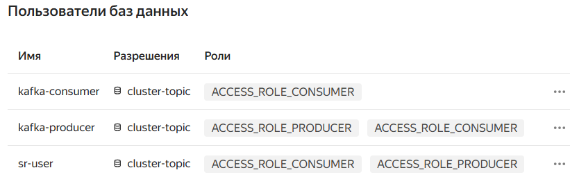

# TASK_1: Up cluster in cloud
### Kafka settings: default settings are used, only public host and schema registry toggles are set to true

### Crating cluster 

### Topic config

### User


### Produce and consume messages
```
22:24:44.157 INFO  o.a.k.c.s.a.AbstractLogin - Successfully logged in.
22:24:44.182 INFO  o.a.kafka.common.utils.AppInfoParser - Kafka version: 3.5.0
22:24:44.182 INFO  o.a.kafka.common.utils.AppInfoParser - Kafka commitId: c97b88d5db4de28d
22:24:44.183 INFO  o.a.kafka.common.utils.AppInfoParser - Kafka startTimeMs: 1742318684182
22:24:44.183 INFO  p.k.sprint.six.components.Consumer - Starting consumer...
22:24:44.183 INFO  o.a.k.clients.consumer.KafkaConsumer - [Consumer clientId=consumer-consumer-1, groupId=consumer] Subscribed to topic(s): cluster-topic
22:24:44.183 INFO  p.k.sprint.six.components.Consumer - Polling ...
22:24:44.305 INFO  o.apache.kafka.clients.NetworkClient - [Producer clientId=producer-1] Disconnecting from node -1 due to socket connection setup timeout. The timeout value is 460 ms.
22:24:44.306 WARN  o.apache.kafka.clients.NetworkClient - [Producer clientId=producer-1] Bootstrap broker rc1a-s89utbdt01tfp6hh.mdb.yandexcloud.net:9091 (id: -1 rack: null) disconnected
22:24:44.692 INFO  org.apache.kafka.clients.Metadata - [Consumer clientId=consumer-consumer-1, groupId=consumer] Cluster ID: lbtZsGsrTtW-Ytde_DsG6g
22:24:44.693 INFO  o.a.k.c.c.i.ConsumerCoordinator - [Consumer clientId=consumer-consumer-1, groupId=consumer] Discovered group coordinator rc1b-n28esuhc7mcqonug.mdb.yandexcloud.net:9091 (id: 2147483645 rack: null)
22:24:44.695 INFO  o.a.k.c.c.i.ConsumerCoordinator - [Consumer clientId=consumer-consumer-1, groupId=consumer] (Re-)joining group
22:24:45.606 INFO  o.a.k.c.c.i.ConsumerCoordinator - [Consumer clientId=consumer-consumer-1, groupId=consumer] Request joining group due to: need to re-join with the given member-id: consumer-consumer-1-4cbf8c65-ebf3-4e15-bcb8-b5f20500d9c3
22:24:45.606 INFO  o.a.k.c.c.i.ConsumerCoordinator - [Consumer clientId=consumer-consumer-1, groupId=consumer] Request joining group due to: rebalance failed due to 'The group member needs to have a valid member id before actually entering a consumer group.' (MemberIdRequiredException)
22:24:45.606 INFO  o.a.k.c.c.i.ConsumerCoordinator - [Consumer clientId=consumer-consumer-1, groupId=consumer] (Re-)joining group
22:24:45.826 INFO  o.apache.kafka.clients.NetworkClient - [Producer clientId=producer-1] Disconnecting from node -1 due to socket connection setup timeout. The timeout value is 865 ms.
22:24:45.827 WARN  o.apache.kafka.clients.NetworkClient - [Producer clientId=producer-1] Bootstrap broker rc1a-s89utbdt01tfp6hh.mdb.yandexcloud.net:9091 (id: -1 rack: null) disconnected
22:24:46.675 INFO  o.a.k.c.c.i.ConsumerCoordinator - [Consumer clientId=consumer-consumer-1, groupId=consumer] Successfully joined group with generation Generation{generationId=1, memberId='consumer-consumer-1-4cbf8c65-ebf3-4e15-bcb8-b5f20500d9c3', protocol='range'}
22:24:46.681 INFO  o.a.k.c.c.i.ConsumerCoordinator - [Consumer clientId=consumer-consumer-1, groupId=consumer] Finished assignment for group at generation 1: {consumer-consumer-1-4cbf8c65-ebf3-4e15-bcb8-b5f20500d9c3=Assignment(partitions=[cluster-topic-0, cluster-topic-1, cluster-topic-2])}
22:24:46.987 INFO  o.a.k.c.c.i.ConsumerCoordinator - [Consumer clientId=consumer-consumer-1, groupId=consumer] Successfully synced group in generation Generation{generationId=1, memberId='consumer-consumer-1-4cbf8c65-ebf3-4e15-bcb8-b5f20500d9c3', protocol='range'}
22:24:46.987 INFO  o.a.k.c.c.i.ConsumerCoordinator - [Consumer clientId=consumer-consumer-1, groupId=consumer] Notifying assignor about the new Assignment(partitions=[cluster-topic-0, cluster-topic-1, cluster-topic-2])
22:24:46.999 INFO  o.a.k.c.c.i.ConsumerCoordinator - [Consumer clientId=consumer-consumer-1, groupId=consumer] Adding newly assigned partitions: cluster-topic-0, cluster-topic-1, cluster-topic-2
22:24:47.335 INFO  o.a.k.c.c.i.ConsumerCoordinator - [Consumer clientId=consumer-consumer-1, groupId=consumer] Found no committed offset for partition cluster-topic-2
22:24:47.335 INFO  o.a.k.c.c.i.ConsumerCoordinator - [Consumer clientId=consumer-consumer-1, groupId=consumer] Found no committed offset for partition cluster-topic-0
22:24:47.335 INFO  o.a.k.c.c.i.ConsumerCoordinator - [Consumer clientId=consumer-consumer-1, groupId=consumer] Found no committed offset for partition cluster-topic-1
22:24:47.831 INFO  o.a.k.c.c.i.SubscriptionState - [Consumer clientId=consumer-consumer-1, groupId=consumer] Resetting offset for partition cluster-topic-0 to position FetchPosition{offset=0, offsetEpoch=Optional.empty, currentLeader=LeaderAndEpoch{leader=Optional[rc1d-auqai0n0qi6o9aad.mdb.yandexcloud.net:9091 (id: 3 rack: ru-central1-d)], epoch=5}}.
22:24:47.854 INFO  o.a.k.c.c.i.SubscriptionState - [Consumer clientId=consumer-consumer-1, groupId=consumer] Resetting offset for partition cluster-topic-1 to position FetchPosition{offset=0, offsetEpoch=Optional.empty, currentLeader=LeaderAndEpoch{leader=Optional[rc1a-s89utbdt01tfp6hh.mdb.yandexcloud.net:9091 (id: 1 rack: ru-central1-a)], epoch=5}}.
22:24:47.861 INFO  o.a.k.c.c.i.SubscriptionState - [Consumer clientId=consumer-consumer-1, groupId=consumer] Resetting offset for partition cluster-topic-2 to position FetchPosition{offset=0, offsetEpoch=Optional.empty, currentLeader=LeaderAndEpoch{leader=Optional[rc1b-n28esuhc7mcqonug.mdb.yandexcloud.net:9091 (id: 2 rack: ru-central1-b)], epoch=4}}.
22:24:47.979 INFO  p.k.sprint.six.components.Consumer - Polled records: org.apache.kafka.clients.consumer.ConsumerRecords@79a7481d
**22:24:47.979 INFO  p.k.sprint.six.components.Consumer - Got 1 records for consumer, partitions: [cluster-topic-2]
22:24:47.980 INFO  p.k.s.six.components.MessageHandler - TOPIC: cluster-topic, USER: User[name=726, favoriteNumber=55, favoriteColor=RED]**
22:24:48.071 INFO  p.k.sprint.six.components.Consumer - Polling ...
22:24:48.142 INFO  org.apache.kafka.clients.Metadata - [Producer clientId=producer-1] Cluster ID: lbtZsGsrTtW-Ytde_DsG6g
22:24:48.224 INFO  o.a.k.c.p.i.TransactionManager - [Producer clientId=producer-1] ProducerId set to 1043 with epoch 0
22:24:48.802 INFO  p.k.sprint.six.components.Consumer - Polled records: org.apache.kafka.clients.consumer.ConsumerRecords@6642a319
22:24:48.802 INFO  p.k.sprint.six.components.Consumer - Got 1 records for consumer, partitions: [cluster-topic-2]
22:24:48.802 INFO  p.k.s.six.components.MessageHandler - TOPIC: cluster-topic, USER: User[name=333, favoriteNumber=759, favoriteColor=CYAN]
**22:24:48.808 INFO  p.k.s.six.components.UserProducer - Sent to topic: cluster-topic, partition: 2, offset; 1**
22:24:48.876 INFO  p.k.sprint.six.components.Consumer - Polling ...
22:24:52.891 INFO  p.k.sprint.six.components.Consumer - Polled records: org.apache.kafka.clients.consumer.ConsumerRecords@1cceeec1
22:24:52.891 INFO  p.k.sprint.six.components.Consumer - Polling ...
```